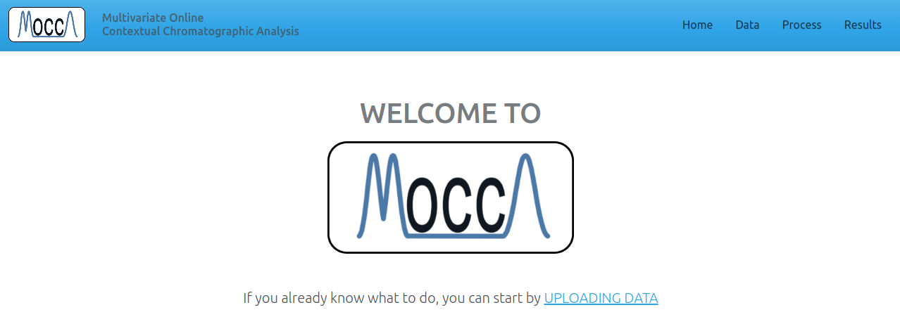
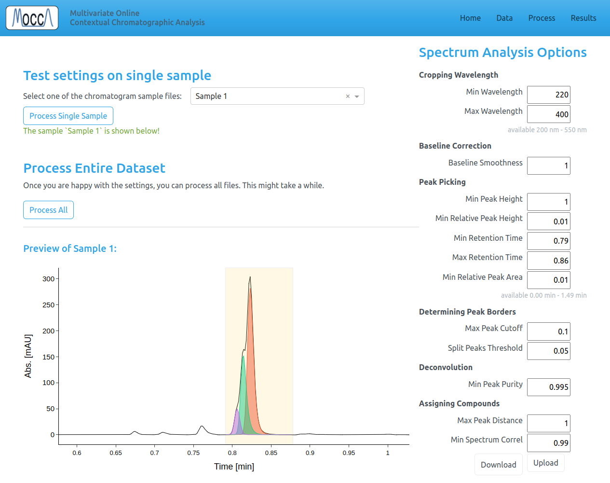
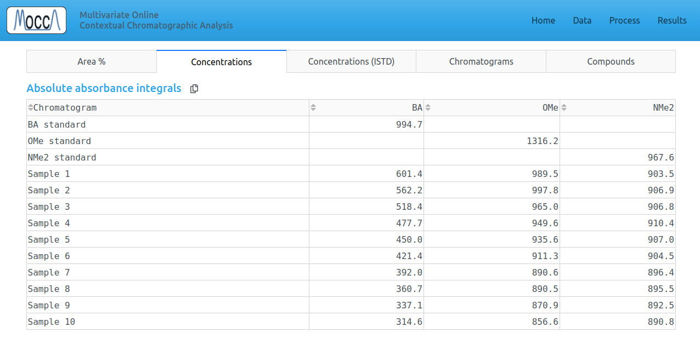
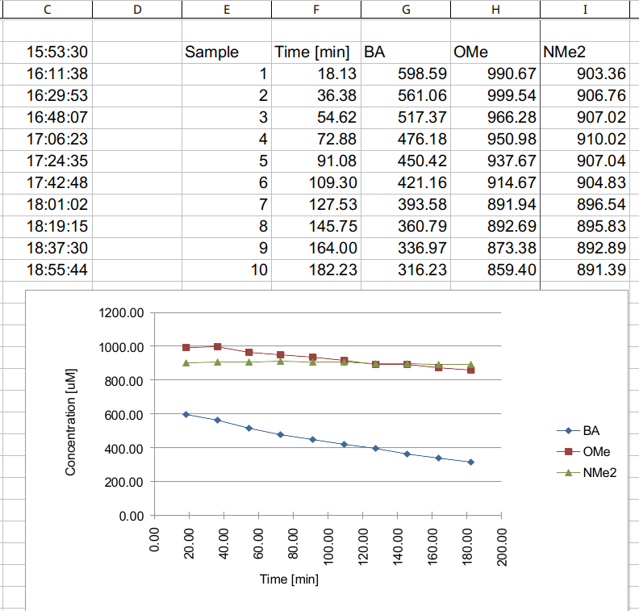

# Web App for MOCCA2

This Web App is a GUI for automatic HPLC chromatogram processing using the [MOCCA2 Python package](https://github.com/oboril/mocca).

To automate your workflow and get accurate results, MOCCA2 features:

 * support for raw data files from Agilent, Shimadzu and Waters
 * automatic baseline correction
 * adaptive peak picking
 * automatic purity checking and peak deconvolution
 * compound tracking across chromatograms
 * fully automatic processing of any number of chromatograms


# Installation

Clone this repository.

```
git clone https://github.com/oboril/MOCCA-frontend
```

Install Python (versions 3.10, 3.11 or 3.12) and install the required packages.

```
python -m pip install -r requirements.txt
```

You can now run the app!

```
python app.py
```

The MOCCA front end should open in your web browser. If the window does not open automatically, go to [localhost:8050](http://localhost:8050/).



# Getting started

First, install and start the MOCCA2 Web App.

## Example data

This tutorial is using example chromatograms from Knoevenagel condensation ([Haas et al., 2023](https://doi.org/10.1021/acscentsci.2c01042)). You can download this data using:

```
git clone -b example-data https://github.com/oboril/MOCCA-frontend
```

The data contains:
- calibration standards
    - blank gradient
    - benzaldehyde, 994.7 uM
    - 4-anisaldehyde, 1316.2 uM
    - N,N-dimethylaminobenzaldehyde, 967.6 uM
- reaction samples
    - blank gradient
    - 10 samples taken roughly every 18:12 (min:sec), accurate times are in the file names
    - the reaction start was at 15:53:30 (first sample was taken after 18:08 min:sec)


## Uploading data

1. Go to the `Data` page.
2. Upload blank chromatogram (just gradient without analytes) - this is optional but strongly recommended.
3. Upload the chromatograms
   - either calibration standards
   - or chromatograms with unknown sample composition for analysis
4. Fill in relevant columns in the table, such as:
   - **Sample Name**: any name for the chromatogram
   - **Compound Name**: if this chromatogram is a reference with known compound, please choose a name for the compound
   - **Concentration**: the concentration of the pure reference compound (if applicable)
   - **ISTD Concentration**: Concentration of ISTD (if present)
5. If you are using internal standard, fill in `Name of ISTD` under the table

After uploading all data, don't forget to `Confirm Changes`!


## Processing the chromatograms

1. Go to the `Process` page.

Here you can adjust settings that MOCCA2 uses to process the chromatograms. The description of all settings is at the bottom of the processing page.

In most cases, the default settings will work just fine and you should change only:
 - **Min and Max Retention Time**: peaks outside these times will be ignored
 - **Min (Relative) Peak Height**: these parameters determine peak picking sensitivity
 - **Min Peak Purity**: depending on signal-to-noise ratio in your chromatograms, you might need to decrease (high noise) or increase (small peaks overlapping with large ones) this value

2. Test the settings on some of your chromatograms using `Process Single Sample`
3. Once you are happy with the settings, click `Process All` to process the entire dataset
    - Processing all chromatograms can take a few minutes. You can see the progress in the command line

You can also download/upload your favourite settings to reuse them.



## Inspecting the results

The processed chromatograms, peak areas and calibrated concentrations are in the `Results` page.



The `Chromatograms` tab provides interactive way to visualize the chromatogram:
- click on the heatmap to change see absorbances at different times and wavelengths
- click and drag on any of the graphs to zoom in
- double click to zoom back out


## Saving the campaign

At any time, you can go to the `Data` page and download the campaign (all chromatograms, processing settings, and processed results) as a `.mocca2` file using the `Download Campaign` button.

**Limitations**: _Dash_ limits the size of the file that can be downloaded to around 300 MB. It might not be possible to download a campaign if it contains too many chromatograms. The `.mocca2` file is compressed before downloading - this helps, but the download can take a few seconds.

You can then restore the campaign by uploading the `.mocca2` file using `Load Campaign`.

## Exporting data

Any tabular data can be copied from `MOCCA2` directly into another program, for example Excel.



# Compiling to executable

If you wish, you can compile everything into a single executable file.

First, install the MOCCA front end and make sure you can start it using `python app.py`.

The app can be compiled using pyinstaller:

```
python -m pip install pyinstaller
pyinstaller app.spec
```

After the command finishes, the executable will be in the `dist` directory.

# Contributing

The process for contributing is outlined in [CONTRIBUTING.md](https://github.com/oboril/MOCCA-frontend/blob/main/CONTRIBUTING.md).


# Code Standards
This section describes the directory structure, file structure, naming of variables, and overall standards for the code.

### Directory Structure
The entry point is `app.py`, Dash pages are in `pages/[page_name]`,
all campaign data and relevant functions are in `campaign/`,
and global variables and local files are handled in `cache/`.

Each **page** folder contains the following:
 * `__init__.py` file with `layout()` function
 * all functions that generate layout must be in files `layout*.py`
 * all callbacks must be in files `callbacks*.py`
 * other functions (data processing, parsing) should be in separate files

### General standards
Imports are in following order:
 * `dataclasses` and `typing`
 * imports from external packages
 * imports from `mocca`
 * imports from this project

All classes shoud use `dataclass`, attributes must be typed and have description.

Functions should be typed (both parameters and return type), and contain description. This may not be neccessary for small helper functions...

### Global variables and cached files
Global variables must be stored in flask cache - this is also neccessary because of how the server works. The variables should be accessed and modified only through functions `cache.get_[variable_name]()` and `cache.set_[variable_name]()`. This helps with typing and prevents spelling mistakes.

Cached files can be stored in the `_cache` folder. All information about the cached files must be in `cache.files`.

_Note that the current implementation is not suitable for having multiple clients - file cache needs to be changed!_

### Running background jobs
The background callbacks provided by Dash don't work very well with flask-cache and are slow.

Background jobs are thus done using python `threading` and the `Interval` component.

### Naming variables
All IDs of html components must be `[page-name]-[component-type]-[anything else]`, for example `process-dropdown-input-file-type`.